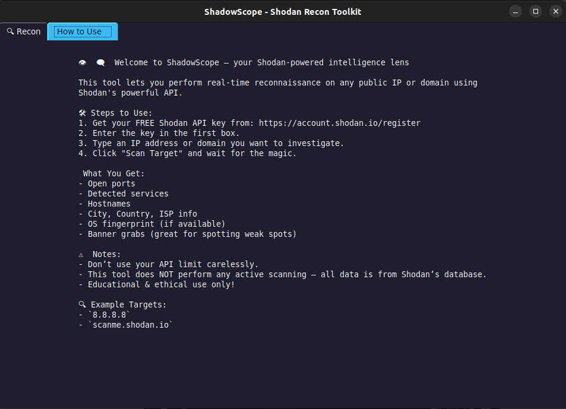

# 🔍 ShadowScope – Shodan Recon Toolkit

**ShadowScope** is a powerful but beginner-friendly GUI-based recon tool built using the [Shodan API](https://www.shodan.io/). It allows you to quickly inspect the public exposure of any IP address or domain — revealing open ports, services, banners, and even geolocation and OS data — all with just a few clicks.

> ⚠️ This tool does **not** perform active scanning. It only queries Shodan's existing indexed data, making it safe and passive for red teamers, researchers, and students.

---

## 🎯 Features

| Feature                      | Description                                                                 |
|-----------------------------|-----------------------------------------------------------------------------|
| 🔐 API Key Integration       | Paste your Shodan API key securely and query instantly                      |
| 🌐 IP/Domain Lookup          | Enter any IP or domain (e.g., `8.8.8.8`, `scanme.shodan.io`)                |
| 📊 Recon Output              | Shows open ports, services, banners, location, ISP, org, and OS             |
| 🖥️ GUI Interface             | Clean tab-based interface using `tkinter`                                   |
| 📘 Built-in Help Tab         | Step-by-step usage instructions, ideal for first-time users                 |
| 🧠 Passive Intelligence      | All results are based on Shodan’s indexed database, no active scan involved |

---

## 📦 Installation

### 1. Clone the repo

```bash
git clone https://github.com/yourusername/shadowscope.git
cd shadowscope
```


## Screenshots
> 